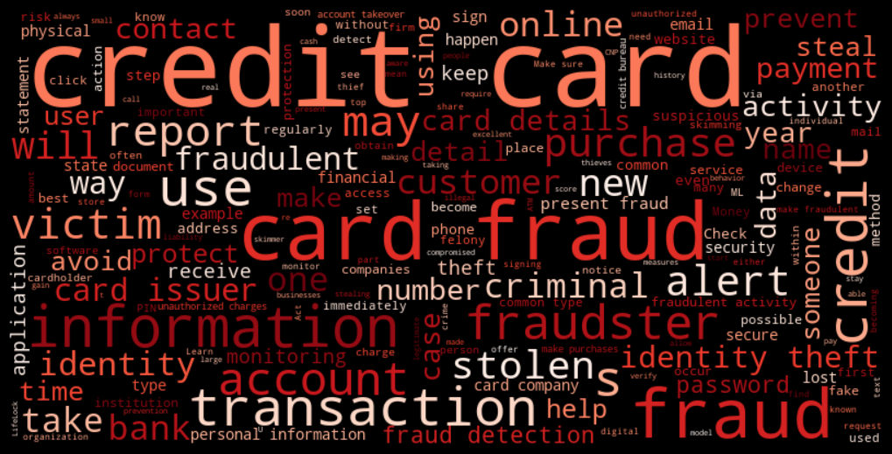

# Fraud prediction in credit card transactions

Credit card fraud is a big problem nowadays. It doesn´t only affect banks, who lose billions each year because of it, it also affects credit card holders and so many shops. 

In a world where fraudsters use technological advances to their advantage, the same should be done to detect their crimes.

For this project, I found two different credit card fraud datasets and experimented creating machine learning fraud prediction models. 

The first dataset can be found [here](https://www.kaggle.com/datasets/dhanushnarayananr/credit-card-fraud) and the second [here](https://www.kaggle.com/datasets/jainilcoder/online-payment-fraud-detection).

## These are the steps I followed:

* EDA for the dataset (See EDA file in notebooks folder for each dataset)

* Preprocessing       (See Preprocessing file in notebooks folder for each dataset)

* Modelling           (See Modelling file in notebooks folder for each dataset)

* Create a dashboard with power Bi which you can find [here](https://app.powerbi.com/view?r=eyJrIjoiODk1ZmMyZDMtMzBkOS00NmZmLWIzOGUtNzZkMmYzNDRhYTE1IiwidCI6ImM1ODY5MTUzLTg1YWMtNGY3Mi1iNDdjLTYyOWRmYmE0ZThlYSIsImMiOjl9)

